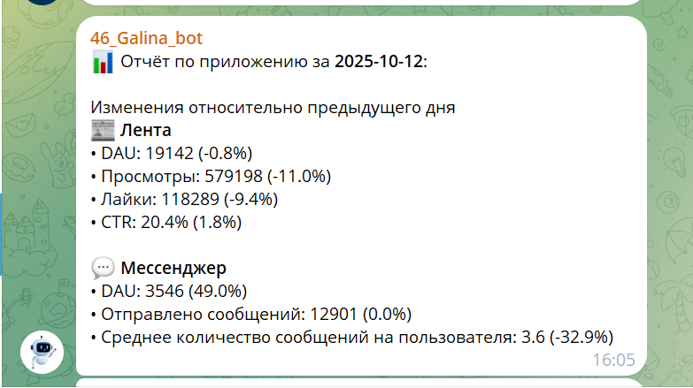
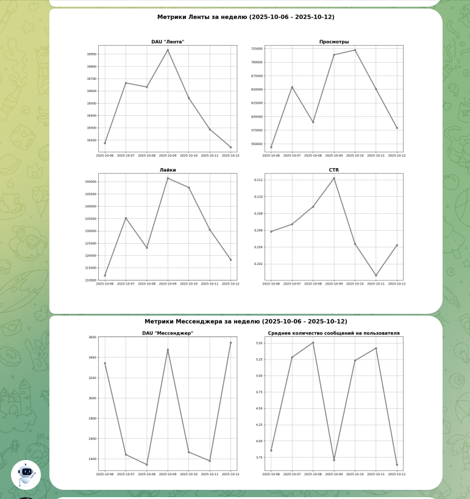

### "Автоматизация отчетности мобильного приложения (лента+мессенджер)"   

**Стек:** Airflow, Gitlab, Telegram, ClickHouse, Pandahouse, Matplotlib.  

**Описание задачи:**  
Необходимо наладить автоматическую отправку аналитической сводки в телеграм каждое утро.  

**Необходимо сделать:**  
1. создать телеграм-бота;   
2. написать скрипт для сборки отчета по ленте новостей и мессенджеру;
3. отчет должен состоять из двух частей:
   - текст с информацией о значениях ключевых метрик за предыдущий день;
   - графики со значениями метрик за предыдущие 7 дней;
4. отобразить в отчете следующие ключевые метрики:
   - По ленте новостей: DAU, Просмотры, Лайки, CTR.
   - По мессенджеру: DAU, количество отправленных сообщений, среднее количество сообщений на пользователя.
5. автоматизировать отправку отчета с помощью Airflow;    
6. код для сборки отчета разместить в GitLab.  

**Этапы работы:**
Создание телеграм-бота, написание скрипта для сборки отчета и автоматизирована отправка.  
Ознакомиться с файлом решения можно здесь: [Full_report]( https://github.com/NailyaGalina/Airflow_reporting_automation_2/blob/main/DAG_full_report.py)   

**Результат:**  
Автоматизирована отправка отчета с ключевыми метриками приложения в телеграм.  

